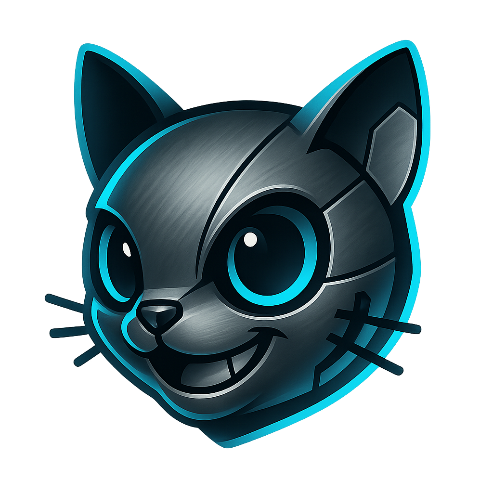

<div align="center">

# 🎤 Titanium Kitten Karaoke (TKK)



**Das ultimative Web-basierte Karaoke-System für Veranstalter**

</div>

Titanium Kitten Karaoke ist ein professionelles Karaoke-Management-System, das speziell für Veranstalter von Karaoke-Events in Bars, Clubs oder auf Parties entwickelt wurde. Es übernimmt die komplette Verwaltung der Songs, Playlists und bietet eine intuitive Benutzeroberfläche für sowohl Veranstalter als auch Teilnehmer.

## 🎯 Was ist Titanium Kitten Karaoke?

Titanium Kitten Karaoke ist ein vollständigeskonnt Karaoke-System, das über einen Web-Browser zugänglich ist. Es funktioniert am besten auf einem Webserver mit statischer IP oder eigener Domain, kann aber auch per ngrok von zu Hause aus betrieben werden. Sowohl die Verwaltung als auch die Live-Videos sind über jeden modernen Web-Browser erreichbar.

**💡 Tipp:** Verwende einen Webserver mit eigener Domain oder einen leistungsstarken Desktop-PC mit ngrok als Server. Während der Live-Karaoke-Show greifst du dann mit einem Laptop über den Browser darauf zu.

## ✨ Features

### 🎵 Song-Management
- **Multi-Format Support**: YouTube-Videos, lokale Videos vom Live-PC und UltraStar Songs
- **USDB Integration**: Direkter Download von Songs aus der größten UltraStar-Datenbank
- **KI-gestützte Konvertierung**: Automatische Erstellung von Instrumental-Versionen ohne Gesang
- **Umfangreiche Song-Verwaltung**: Vollständige Kontrolle über die Musikbibliothek

### 👥 Benutzerfreundlichkeit
- **QR-Code Songwünsche**: Teilnehmer scannen einfach einen QR-Code und geben ihre Songwünsche ein
- **Fairness-Algorithmus**: Intelligente Playlist-Verwaltung, die sicherstellt, dass jeder Teilnehmer fair behandelt wird
- **Live-Playlist**: Echtzeit-Anzeige der aktuellen Songreihenfolge
- **Responsive Design**: Funktioniert auf allen Geräten - Desktop, Tablet, Smartphone
- **🌍 Mehrsprachigkeit**: Vollständige Unterstützung für 12 Sprachen (DE, EN, ES, FR, FI, NL, PL, SV, RU, JA, KO, ZH)

### 🛠️ Admin-Features
- **Vollständiges Admin-Dashboard**: Komplette Kontrolle über Playlist und Einstellungen
- **Nutzerverwaltung**: Ban-Lists und Benutzer-Management
- **Live-Controls**: Direkte Steuerung der aktuellen Karaoke-Session
- **Einstellbare Parameter**: Anpassung des Fairness-Algorithmus und anderer Systemeinstellungen

### 🎬 Live-Features
- **Live-Video-Stream**: Direkte Übertragung der aktuellen Karaoke-Session
- **Multi-Browser-Support**: Verschiedene Browser-Fenster für verschiedene Funktionen
- **Beamer-Integration**: Optimiert für die Übertragung auf große Bildschirme

## 🔧 Voraussetzungen

### Server-Anforderungen
- **Node.js** (Version 18 oder höher) mit npm
- **Python 3.10** oder höher (für KI-Features)
- **CUDA** (für Hardwarebeschleunigung bei KI-Features)
- **Freie Ports**: 3000, 5000, 6000, 4000 (für lokale Dateien)

### Live-PC Anforderungen
- **Internetfähiger Browser** (Chrome, Firefox, Safari, Edge)
- **Stabile Internetverbindung** (für Remote-Zugriff)

## 🚀 Installation

### Automatische Installation
1. **Repository klonen oder Dateien herunterladen**
2. **`install.bat` ausführen** - Das Skript erledigt alles automatisch

### Manuelle Installation (falls nötig)
```bash
# Backend-Dependencies installieren
npm install

# Frontend-Dependencies installieren
cd client
npm install
cd ..

# Python-Dependencies für KI-Features
cd ai-services
python -m venv venv
# Windows:
venv\Scripts\activate
# Linux/Mac:
# source venv/bin/activate
pip install -r requirements.txt
cd ..
```

## 🎮 Benutzung

### Server starten
1. **`start.bat` ausführen** - Startet das komplette System
2. **Optional**: ngrok auf Port 5000 starten für Remote-Zugriff

### URLs und Zugriff
- **`localhost:5000`** - Aktuelle Playlist anzeigen
- **`localhost:5000/admin`** - Admin Dashboard für Playlist-Management und Einstellungen
- **`localhost:5000/show`** - Live-Video der aktuellen Karaoke-Session
- **`localhost:5000/new`** - QR-Code-Ziel für Songwünsche der Teilnehmer

### 💡 Empfohlene Setup-Anordnung
1. **Admin-Dashboard** auf dem Laptop für den Veranstalter (dich) öffnen
2. **Live-Session** (`/show`) in einem zweiten Browserfenster öffnen
3. **Live-Session** per Beamer oder zweiten Bildschirm an das Publikum richten
4. **QR-Code** für Teilnehmer bereitstellen

### ⚙️ Wichtige Konfiguration
- **Öffentliche Adresse**: Im Admin-Dashboard die öffentliche Server-Adresse angeben, damit der QR-Code funktioniert
- **Ports freigeben**: Stellen Sie sicher, dass die benötigten Ports (3000, 5000, 6000, 4000) verfügbar sind

## 🧠 Fairness-Algorithmus

Der integrierte Fairness-Algorithmus sorgt für eine gerechte Verteilung der Songs:

- **Priorisierung**: Teilnehmer mit weniger Songs werden bevorzugt
- **Verhinderung von Stapelung**: Kein Teilnehmer kann mehrere Songs hintereinander singen
- **Intelligente Einfügung**: Neue Songs werden optimal in die bestehende Playlist eingefügt
- **Einstellbare Parameter**: Maximale Verschiebungen pro Song konfigurierbar

## 🎵 Unterstützte Formate

- **YouTube-Videos**: Direkte Integration über Links
- **Lokale Videos**: Videos vom Live-PC (direktes Streaming)
- **Remove Videos**: Videos vom Server
- **UltraStar Songs**: Unterstützung des UltraStar-Formats
- **USDB-Downloads**: Automatischer Download aus der UltraStar-Datenbank
- **KI-Konvertierung**: Automatische Erstellung von Instrumental-Versionen

## 🔒 Sicherheit & Verwaltung

- **JWT-basierte Authentifizierung** für Admin-Bereiche
- **Nutzerverwaltung** mit Ban-Funktionalität

**Viel Spaß mit Titanium Kitten Karaoke! 🎤🎵**

*Entwickelt für professionelle Karaoke-Veranstaltungen*