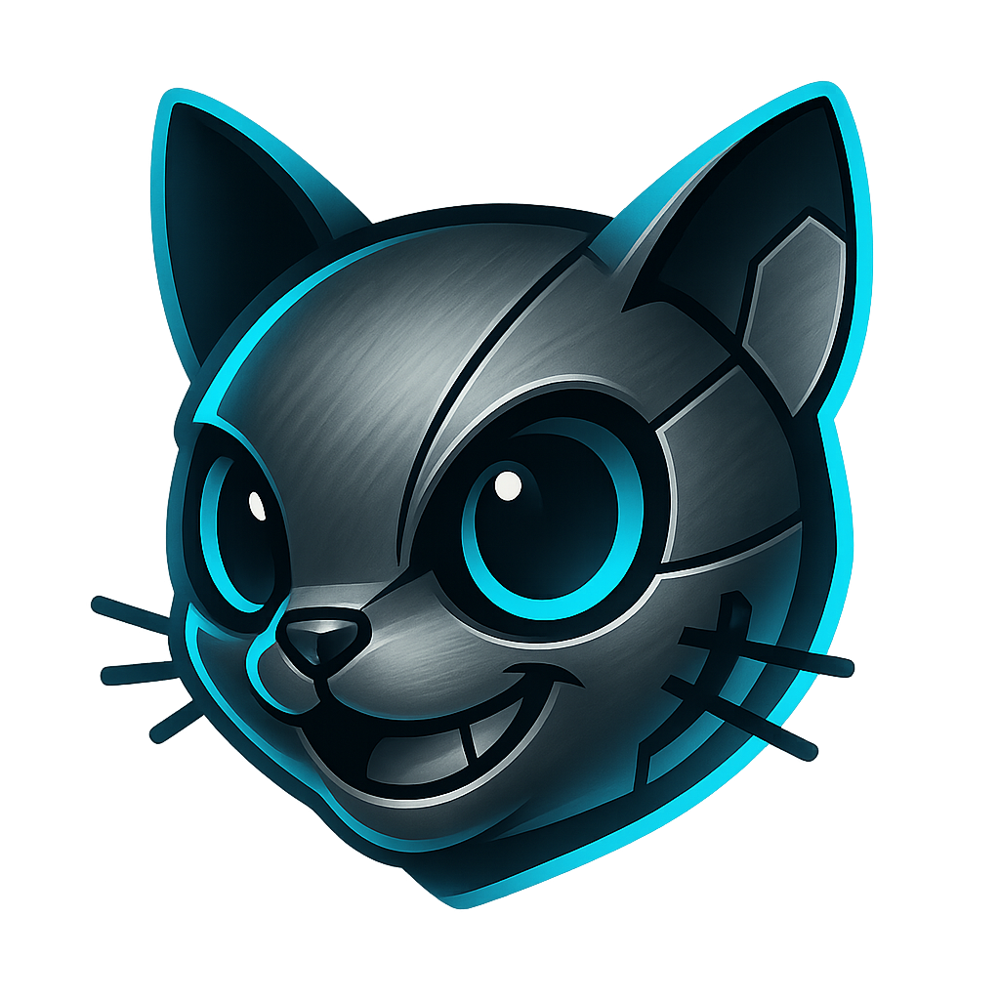

<div align="center">

# 🎤 Titanium Kitten Karaoke (TKK)



**The ultimate web-based karaoke system for event organizers**

Titanium Kitten Karaoke is a professional karaoke management system specifically designed for organizers of karaoke events in bars, clubs, or parties. It handles complete song and playlist management and provides an intuitive user interface for both organizers and participants.

</div>


## 🎯 What is Titanium Kitten Karaoke?

Titanium Kitten Karaoke is a complete karaoke system accessible through a web browser. It works best on a web server with a static IP or custom domain, but can also be operated from home using Cloudflare Tunnel. Both administration and live videos are accessible through any modern web browser.

**💡 Tip:** Use a web server with a custom domain or a powerful desktop PC with Cloudflare Tunnel as server. During the live karaoke show, you then access it with a laptop through the browser.

<div style="clear: both;"></div>

## ✨ Features
### 🎵 Song Management


- **Multi-Format Support**: YouTube videos, local videos from live PC and UltraStar songs
- **USDB Integration**: Direct download of songs from the largest UltraStar database
- **AI-powered Conversion**: Automatic creation of instrumental versions without vocals
- **Magic Songs**: AI-powered on-the-fly karaoke creation from any song - convert any YouTube video, local video or audio file into a karaoke version with lyrics and perfect instrumental tracks
- **Comprehensive Song Management**: Complete control over the music library
<div style="clear: both"></div>

### 👥 User Experience


- **QR-Code Song Requests**: Participants simply scan a QR code and enter their song requests
- **Fairness Algorithm**: Intelligent playlist management ensuring every participant is treated fairly
- **Live Playlist**: Real-time display of current song order
- **Responsive Design**: Works on all devices - desktop, tablet, smartphone
- **🌍 Multilingual**: Full support for 12 languages (DE, EN, ES, FR, FI, NL, PL, SV, RU, JA, KO, ZH)

<div style="clear: both;"></div>

### 🛠️ Admin Features


- **Complete Admin Dashboard**: Full control over playlist and settings
- **User Management**: Ban lists and user management
- **Live Controls**: Direct control of current karaoke session
- **Configurable Parameters**: Adjustment of fairness algorithm and other system settings

<div style="clear: both;"></div>

### 🎬 Live Features


- **Live Video Stream**: Direct transmission of current karaoke session
- **Multi-Browser Support**: Different browser windows for different functions
- **Projector Integration**: Optimized for transmission to large screens

<div style="clear: both;"></div>

## 🔧 Requirements

### Server Requirements
- **Node.js** (Version 18 or higher) with npm
- **Python 3.10** or higher (for AI features)
- **FFmpeg** (current version) installed and available in `PATH`
- **CUDA** (for hardware acceleration with AI features)
- **Free Ports**: 3000, 5000, 6000, 4000 (for local files)

### Live PC Requirements
- **Internet-capable Browser** (Chrome, Firefox, Safari, Edge)
- **Stable Internet Connection** (for remote access)

## 🚀 Quick Start


**New to Titanium Kitten Karaoke?** Check out our comprehensive Getting Started Guides for detailed installation instructions, dependency setup, and first-time configuration:

- 🇩🇪 [Deutsche Anleitung](docs/getting-started-de.md) - Komplette Einrichtung auf Deutsch
- 🇬🇧 [English Guide](docs/getting-started-en.md) - Complete setup guide in English

### Quick Installation
1. **Clone repository or download files**
2. **Run `install.bat`** - The script handles everything automatically
3. **Run `start.bat`** - Start the complete system

### Essential Dependencies
- **Node.js** (Version 18+) - [Download](https://nodejs.org/)
- **Python 3.10+** - [Download](https://www.python.org/downloads/)
- **FFmpeg** - [Download](https://ffmpeg.org/download.html) (add to PATH)
- **CUDA** (optional) - [Download](https://developer.nvidia.com/cuda-downloads)

For detailed installation instructions, troubleshooting, and configuration, see the Getting Started Guides:

- 🇩🇪 [Deutsche Anleitung](docs/getting-started-de.md) - Komplette Einrichtung auf Deutsch  
- 🇬🇧 [English Guide](docs/getting-started-en.md) - Complete setup guide in English

<div style="clear: both;"></div>
## 🎮 Usage

### Starting the Server
1. **Run `start.bat`** - Starts the complete system
2. **Optional**: Start Cloudflare Tunnel for remote access (see Cloudflare Tunnel Setup below)

### URLs and Access
- **`localhost:5000`** - Display current playlist
- **`localhost:5000/admin`** - Admin dashboard for playlist management and settings
- **`localhost:5000/show`** - Live video of current karaoke session
- **`localhost:5000/new`** - QR code target for participant song requests

### 💡 Recommended Setup Arrangement
1. **Admin Dashboard** open on laptop for organizer (you)
2. **Live Session** (`/show`) open in a second browser window
3. **Live Session** direct to audience via projector or second screen
4. **QR Code** provide for participants

### ⚙️ Important Configuration
- **Public Address**: Specify the public server address in the admin dashboard so the QR code works
- **Open Ports**: Make sure the required ports (3000, 5000, 6000, 4000) are available

## 🌐 Cloudflare Tunnel Integration

For remote access without exposing your local network, Titanium Kitten Karaoke includes built-in Cloudflare Tunnel support:

### Easy Setup via Admin Panel
1. **Access Admin Dashboard** at `localhost:5000/admin`
2. **Navigate to Settings** section
3. **Find Cloudflare Tunnel** integration
4. **Click "Install & Start"** button - The system handles everything automatically

### Benefits of Built-in Cloudflare Tunnel


- **One-click installation** and setup
- **No manual configuration** required
- **Automatic HTTPS** with Cloudflare certificates
- **DDoS protection** included
- **Global CDN** for better performance
- **No port forwarding** required
- **Free tier** available

### Manual Configuration (Advanced)
If you prefer manual setup or need custom configuration:

1. **Download cloudflared** from [Cloudflare Tunnel Downloads](https://github.com/cloudflare/cloudflared/releases)
2. **Login to Cloudflare**:
   ```bash
   cloudflared tunnel login
   ```
3. **Create and configure tunnel** as needed
4. **Add DNS records** in your Cloudflare dashboard

<div style="clear: both;"></div>

## 🧠 Fairness Algorithm


The integrated fairness algorithm ensures fair distribution of songs:

- **Prioritization**: Participants with fewer songs are preferred
- **Prevention of Stacking**: No participant can sing multiple songs in a row
- **Intelligent Insertion**: New songs are optimally inserted into the existing playlist
- **Configurable Parameters**: Maximum shifts per song configurable

## 🎵 Supported Formats

- **YouTube Videos**: Direct integration via links
- **Local Videos**: Videos from live PC (direct streaming)
- **Remote Videos**: Videos from server
- **UltraStar Songs**: Support for UltraStar format
- **USDB Downloads**: Automatic download from UltraStar database
- **AI Conversion**: Automatic creation of instrumental versions and lyrics

<div style="clear: both;></div>

## 🔒 Security & Management

- **JWT-based Authentication** for admin areas
- **User Management** with ban functionality

**Have fun with Titanium Kitten Karaoke! 🎤🎵**

*Developed for professional karaoke events*